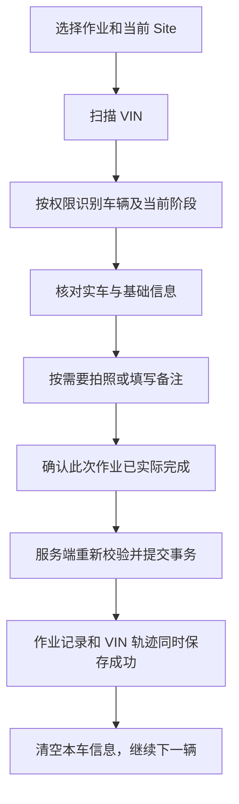

# 车辆独立作业记录实施方案

日期：2026-09-23。本文是基于当前代码的实施建议，尚未新增业务功能、数据库结构或界面。

## 1. 已确认范围

- App：选择作业、扫描 VIN、识别车辆、照片/备注、确认完成。
- 网页：充电、洗车、PDI、维修四个独立管理入口；VIN、日期、操作人筛选；详情、照片和 VIN 轨迹。
- 在库车辆可以作业；待入库车辆由人员确认现场实车后记录。
- 四种作业之间没有固定顺序；记录完成事实，不增加派工、接单、审批、前置作业或强制发运条件。
- 同一 VIN 可以多次进行同一种作业，每次真实作业形成独立记录。

建议按“一套作业记录服务、四类管理页面、一个 App 通用执行页面”实施，四类不各自复制数据库、接口和扫码代码。

## 2. 与现有库存流程的关系

| 车辆阶段 | 建议处理 | 库存影响 |
| --- | --- | --- |
| 系统无 VIN | 拒绝确认；通过现有登记业务先解决车辆身份，不借作业接口自动建单入库 | 无 |
| 待入库 EXPECTED | 限当前机构、有效入库订单及目标 Site；执行人员确认实车在现场且作业已完成，保存确认依据与当时阶段 | 不改 ARRIVED，不占位，不建库存 |
| 停车区 PARKING | 关联当前在场记录，保存当时位置 | 无 |
| 待装区 STAGING | 同停车区；不能把完成洗车解释为可装车 | 无 |
| 已开单未装车 | 允许真实作业；保留原出库单及运单关系 | 无 |
| 已装待出 LOADED | 仍是在场车辆；如记录实际已完成的作业，保留 LOADED。现场需要卸车或移位时走现有操作，不由作业完成自动代办 | 无 |
| 已离场、取消车辆、其他场地在库车辆 | 本期不开放普通现场作业确认；历史仍可按权限查询 | 无 |

“待入库现场确认”只证明人员声明实车到场并完成了此次作业，不等于已经建立门岗到达、卸车、接管或质量验收流程。确认可以融入已有的“确认作业”，无需增加一串确认弹框。

车辆身份还有一个范围需在实施前明确：纯运输模块也可能有 VIN，但它不一定有仓储 order_vins 档案或目标场地。本方案建议第一期覆盖有效仓储订单中的待入车辆与在库车辆；仅有纯运输记录的 VIN 应明确提示不在本期场地作业范围，不能随意拿运输订单充当入库关联。如果业务要求它们也可作业，需要增加明确的车辆身份来源和 Site 归属规则。

待入库记录关联 orderVinId，inventoryId 为空；将来入库后仍可按 VIN/订单追溯。不能把旧记录改成“在库时发生”，也不能仅按未来当前库存倒推当时状态。

洗车、充电等不调用库存 receive/move/load/close，不写库存数量流水，不重置库龄，不自动改变库位、解冻或放行。库位锁与车辆质量限制仍遵循原有边界。

## 3. App 执行流程

扫描/查询本身不产生完成记录。确认前关闭页面、取消或识别失败，也不产生作业完成事件。

执行人由登录身份在服务端确定，禁止客户端指定另一账号代替。显示采用当前账号名称口径 displayName，缺失时回退 username，并保存当时名称快照；筛选依据 userId，防止同名混淆、改名后丢历史。

场地人员使用授权绑定 Site；跨场管理人员进入作业时选择有权限的 Site。服务端校验当前在库场地或待入订单目标场地，不信任客户端任意传入的 Site。

第一期建议在线提交，以服务端确认时刻作为完成记录时间，另保留录入时间字段。暂不开放任意补填历史时间或离线排队；若现场需要事后补录，应单独明确实际完成时间、录入时间、权限与补录原因。

## 4. 数据和事务设计

建议新增 `vehicle_work_records`，作为作业管理的业务依据。`operation_logs` 继续承担 VIN 轨迹与审计，不能只往它的 JSON 写信息再当作完整作业台账。

| 数据 | 用途 |
| --- | --- |
| id | 每次作业独立编号，详情、照片与轨迹关联依据 |
| organizationId、yardId | 机构/Site 权限与筛选；保存 Site 名称/代码快照用于历史展示 |
| vin、orderVinId、orderId | VIN 及业务归属；有歧义时不能随意取第一条 |
| inventoryId（可空） | 在库作业关联本次在场；待入库作业允许空 |
| vehicleStage、position/slot 快照 | 保存作业发生时状态，不能依赖未来车辆当前位置 |
| workType | CHARGING、WASHING、PDI、REPAIR；统一类型定义，后续增加类型沿用同一服务 |
| completedAt、createdAt | 完成记录时间与系统录入时间，存带时区时间 |
| operatorUserId、operatorNameSnapshot | 执行账号、当时显示名称 |
| photoKeys、remark | 绑定该条记录的照片对象键及备注 |
| status、voidReason、voidedBy、voidedAt | 有效/作废及误录纠正依据；作废不代表现场工作被倒退 |
| requestId | 一次确认的幂等标识，防网络重试重复记账 |

四种作业第一期只需统一类型定义，不建设作业类型配置后台、可视化流程或动态表单引擎。照片默认按需求可选；某类业务确认必须留照后，由服务端和 App 同时执行该类型规则。

确认接口的一个事务中：校验操作权限和当前车辆归属/阶段 → 保存作业记录 → 通过 `AuditService.log(data, manager)` 保存关联 recordId 的轨迹事件 → 提交。审计写入失败则整笔回滚，不返回作业成功。

扫描结果只用于展示，提交时必须重新校验。对身份/在场记录加合适的事务锁，并沿用库存接口的锁顺序，防止识别后车辆已经离场、撤销或转入其他业务仍按旧状态提交。作业不新增长期业务锁。

幂等唯一约束围绕机构和 requestId，不以 VIN + 类型作唯一键。同一请求重试返回原结果；相同 requestId 携带不同内容应拒绝。第二次真实洗车使用新的 requestId，保留第二条记录。

## 5. VIN 轨迹及照片

作业完成事件可统一为 `VEHICLE_WORK_COMPLETED`，在 payload 中携带 workRecordId、workType、当时账号/Site名称等；作废使用独立事件并指向原记录。轨迹按业务发生时间排序，时间相同时使用稳定键保证顺序。

注意两条现有查询路径：

- `/tracking/timeline/vin/:vin` 合并 operation_logs 与 waybill_status_logs。
- `/yards/vin/:vin/lifecycle` 供 VIN 生命周期抽屉使用，另读入库信息、运单事件和库存流水。

实施时两处都需接入同一作业事件来源。作业详情点击 VIN 应直接打开对应车辆轨迹，不让用户重新输入；当前独立轨迹页没有自动读取 VIN 参数的入口，需要接通导航参数及工作区标签传参。

图片复用现有上传、短期授权链接及照片预览。数据只保存 object key，避免将会过期的预览 URL 当永久证据。

- 上传结束不等于作业成功；全部需要的照片上传完成后再确认。
- 确认时验证附件存在、类型及上传者/机构归属，不能凭猜到或复制的 key 绑定其他人的照片。
- 查询预览权限要识别新作业记录；有作业查看权限的人员应能查看对应照片，不要求额外取得不相关的入库或运单权限。
- 同时明确轨迹访问范围：首期作业面向内部授权人员。现有轨迹可按订单关联向客户/承运商返回事件，不能因为挂了 orderId 就自动开放新增维修照片；服务端需按作业查看授权过滤新事件，附件授权保持一致。
- 上传成功但提交失败的对象不生成轨迹；重试使用原 requestId 和已上传对象。未引用对象清理按独立保留策略处理，不能删除仍被有效/作废历史引用的证据。

## 6. 网页与维护边界

充电管理、洗车管理、PDI 管理、维修管理各有入口与固定类型筛选，复用一套表格和详情。表格按每次作业一行，不按 VIN 合并覆盖。

保持需求中的列：VIN、作业时间、操作人、照片、备注、详情/轨迹。VIN 本身可点击打开轨迹，避免再增加一个重复的轨迹按钮。照片在当前单元格或详情内预览。

VIN、日期、操作人由服务端分页筛选，设置页大小上限。日期按当前 Site/机构时区解释并转换成明确时间区间；不混用浏览器时区和库存业务日截点。多 Site 查询必须能辨认记录的 Site，优先使用既有场地上下文与详情，不随意堆叠筛选项。

建议第一期维护范围为“误录作废，原因必填；必要时重新记录”，不支持静默覆盖 VIN、类型、执行人和完成时间，也不物理删除历史。正常列表统计有效记录，作废记录保留明确状态，仍可追溯；原完成事件在轨迹中标记已作废，并展示实际作废时间的纠正事件。

作废只在详情内提供有权限的必要入口，不扩展派工、审批、看板指标等功能。补照片/补备注是否允许留待明确；如果需要，应追加变更记录并保留原证据，不能设计一个无审计的通用编辑接口。

“PDI 已完成”表示人员确认做过此次检查，不自动等于检查合格；“维修已记录”也不自动表示解除质量限制。若要记录合格/不合格、维修后仍待处理，需要另外明确结果字段；第一期不能默认为全部合格或据此自动允许启运。

## 7. 拟新增接口和接入位置

以下为建议路径，不是当前已有 API。

| 接口 | 用途 |
| --- | --- |
| `GET /vehicle-works/lookup?vin=&yardId=&workType=` | App 查询有权作业的车辆、基础信息、阶段与当前业务关联 |
| `POST /vehicle-works` | 确认完成，幂等提交；服务器确定人员、时间和归属 |
| `GET /vehicle-works?workType=&vin=&from=&to=&operatorId=&yardId=&page=` | 四个管理页共用分页查询 |
| `GET /vehicle-works/:id` | 详情、证据与纠正信息 |
| `POST /vehicle-works/:id/void` | 有权限人员带原因作废误录 |

作业查询、执行、作废分别授权，并贯穿接口、App入口、网页菜单、列表、详情、轨迹和照片。App 查询不复用带“提货任务”限制的 lookup 接口，也不只查活跃库存而漏掉待入车辆。普通用户无法通过换 VIN、Site 或 recordId 越权。

已有更新通知只识别 yard/policy/dashboard，订阅网关仅允许 board/dashboard 视图；新作业不会自动获得提交后通知。需要明确增加作业通知种类和带作业权限的订阅范围。

新增/作废事务提交后，通知当前机构/Site对应作业视图；当前可见页面按现有筛选重新读取当前页，多次通知合并。作业不变库存，不触发整场 stats/slots 重查。断线重连、重新激活页面时补查；通知仅提示数据变更，数据库仍是事实依据。保留低频一致性补查时也只针对可见作业页，不恢复秒级全量轮询。

## 8. 实施顺序与验收

1. 后端迁移、作业服务、权限、照片绑定、幂等与同事务审计；不得以 synchronize 替代迁移。
2. App 复用 VIN 扫描、照片和账号信息组件，接入一套通用作业确认页面。
3. 网页四个管理入口共用列表/详情，补齐导航、权限及已有语言资源。
4. 两处 VIN 轨迹、附件授权、作业提交后的通知同时贯通。
5. 真实数据库与 App/网页联调验收后按备份、迁移、后端、网页、App 的兼容顺序发布。

核心验收用例：

- 仅扫描不新增记录；确认后作业详情与 VIN 轨迹同时出现，并可由另一名有权限人员查看照片。
- 不存在 VIN、取消车辆、跨机构、跨 Site、无权限账号均无法记录或读取证据。
- 待入车记录洗车后依旧 EXPECTED，库存、库位与库龄均不变；以后入库仍保留原作业历史。
- PARKING/STAGING/LOADED 作业后库存与位置不变；识别后并发离场/撤销时提交重新校验。
- 同 VIN 两次真实洗车有两条记录；同次确认重试只有一条记录和一个完成事件。
- 作业写入或审计任一步失败时整体回滚；图片失败不显示作业成功。
- 误录作废原因、人员、时间及原照片可追溯，不删原完成事实；“合格/可放行”不会凭记录存在自动成立。
- 账号改名或停用后仍能看到当时执行人；日期跨时区边界筛选正确。
- 四个列表、两处 VIN 轨迹的权限和照片权限一致；客户/承运商不因订单关联意外取得新作业信息。
- 只有相关可见作业页收到变更后刷新；重连可恢复，无无关库存查询风暴。

## 9. 代码核验依据

- [库存实体](../backend/src/modules/inventory/entities/yard-inventory.entity.ts)：本次在场标识、LOADED 与关闭时间。
- [轨迹服务](../backend/src/modules/tracking/tracking.service.ts)：事件合并、时间排序、账号名称与机构/客户/承运商过滤。
- [审计服务](../backend/src/modules/tracking/audit.service.ts)：显式 manager 传入才走强事务；未传时旧路径会捕获日志失败。
- [生命周期服务](../backend/src/modules/yards/yards.service.ts)：getVinLifecycle 使用另一份查询。
- [轨迹页面](../frontend/src/app/(dashboard)/tracking/page.tsx)、[生命周期抽屉](../frontend/src/components/vin/VinLifecycleDrawer.tsx)、[工作区路由](../frontend/src/components/layout/workspaceRegistry.tsx)。
- [附件服务](../backend/src/modules/storage/storage.service.ts)：上传者元数据、业务引用权限和短期链接。
- [App扫码入库页面](../app/alms/app/src/main/java/com/automotive/alms/feature/inbound/presentation/InboundScanScreen.kt)：已有扫码、照片及表单组件的实际使用。
- [更新通知服务](../backend/src/modules/operational-updates/operational-updates.service.ts)、[订阅网关](../backend/src/modules/operational-updates/operational-updates.gateway.ts)、[网页可见性与刷新](../frontend/src/lib/live/use-live-yard-data.ts)。
