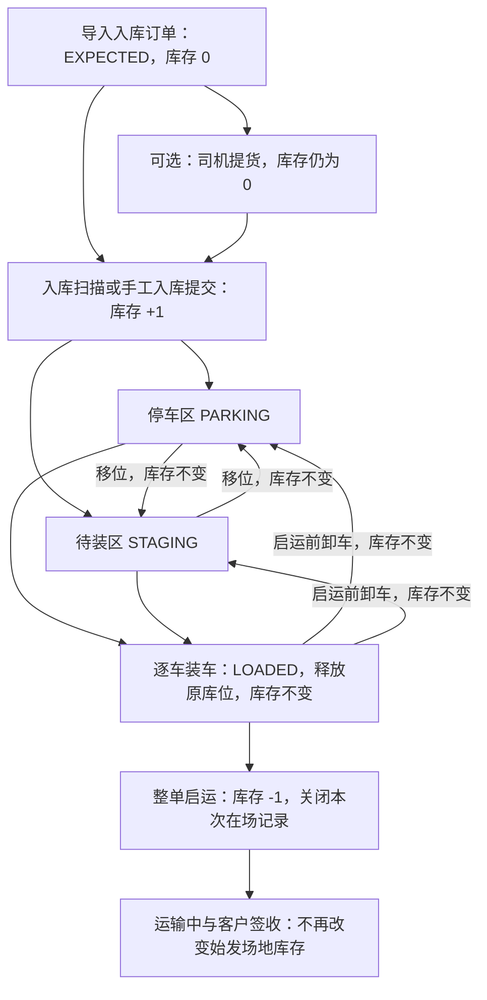

# 车辆库存与场地作业流程核验

核验日期：2026-09-22。代码基线：`ad54b1d`。

本次仅分析，新增本报告，不调整业务代码、数据库或界面。核对了后端实体、服务和控制器，网页实际调用，以及 Android App Repository/Screen。未连接生产数据库或访问现场，因此“存在”指当前代码有相应数据和执行路径，不代表生产已有多少条此类记录，也不代表现场一定按该步骤执行。

本文“库存”指场地在场车辆数量，单位为台；当前库存模型不是车辆资产估值或财务货权台账。

## 1. 最重要的结论

1. **正式入库的记账节点是入库接口事务提交。** 导入订单、分派提货、司机提货、创建入库批次都不会增加 `yard_inventory`。入库扫描一次性完成照片/车检信息记录、占用库位、车辆到货和库存新增。
2. **出库准备从绑定出库订单开始，真正扣减在场库存在整单启运提交时发生。** 开单、移入待装区、装车都不扣库存。装车释放原停车位，车辆进入 `LOADED`，仍算在场。
3. **“待装”有两个不同含义。** `STAGING` 是待装区这个物理位置；运单已创建但车辆未装车，是业务进度。两者不能合成同一个数量或状态。
4. **“待入”只有较粗的 EXPECTED。** 已预报未提货、已提货在途、已到门口待卸、已卸待验等目前没有完整的独立作业状态。`pickedUpAt` 能辅助区分是否提过货，但不能证明车辆已经到门口。
5. **“锁定”并不是一个统一的库存冻结功能。** 库位锁字段、出库订单绑定、运单分配、运单签收锁、数据库事务锁都存在；没有查到贯穿移位、整备、装车、启运的车辆级冻结/解冻流程。
6. **当前已有库存账和直接操作，没有完整的库内作业任务管理。** 系统记录操作结果，但没有统一的作业派发、接单、开始、暂停、异常处理、复核及完工过程。

## 2. 当前库存如何增加、保持和减少

当前在场判断以 `yard_inventory.closed_at IS NULL` 为准。正常数据下：

```text
在场车辆 = PARKING 停车区车辆 + STAGING 待装区车辆 + LOADED 已装待出场车辆

期末库存 = 期初库存 + 期内初始化 + 正常入库 - 发运离场
           - 撤销误入库 + 盘盈 - 盘亏
```

`inventory_movements` 保存不可修改的库存流水。`INBOUND/ADJUST_IN` 为 +1，`DEPARTURE/UNDO_INBOUND/ADJUST_OUT` 为 -1，`MOVE/LOAD/UNLOAD` 为 0；`OPENING` 是历史迁移的期初基线，不是日常操作入口。正常入库和今日出库分别按 `INBOUND`、`DEPARTURE` 统计，盘点、撤销不混入正常发运量。业务日按机构时区和截点划分。[库存写入规则](../backend/src/modules/inventory/inventory.service.ts#L96)、[日活动统计](../backend/src/modules/dashboard/dashboard.service.ts#L429)



图中装车还必须满足派送运单等前提，详见下文。入库可以直接进入 STAGING，装车也可以直接从 PARKING 发起，系统没有强制“先移入待装区才准装车”。

容易误读的地方：

- `OrderVin.arrivalStatus=ARRIVED` 表示曾完成该入库记录的到货。正常发运后没有改回 EXPECTED，因此不能拿 ARRIVED 数量直接算当前库存。
- `slotId=null` 可能是已装车，也可能是离场、待入或异常，不能单独判出库。
- `Waybill.status=NOT_ARRIVED` 在当前派送流程中代表尚未启运，可能未装、部分装、全部装完；它不是“这台车尚未入库”。
- 锁定、停止使用一个区域不会自动让区内车辆出库；容量是否可用与车是否在场是两个口径。
- 正常扫描按提交时刻记到货时间；盘盈可以填写过去的实际到场时间，但调整流水发生时间是本次调整时间，不能把它当成历史正常收货流水。

## 3. 状态是否真实存在

| 业务叫法 | 当前真实表达 | 是否计在场库存 | 如何产生/解除 | 完整程度 |
| --- | --- | --- | --- | --- |
| 预报待入 | 活跃入库订单下 VIN 为 `EXPECTED` | 否 | 入库导入；扫描变 ARRIVED，取消变 CANCELLED | 有基本状态 |
| 已提货待到场 | EXPECTED + `pickedUpAt` 有值 | 否 | 网页或 App 提货扫描 | 可从字段推导，没有独立到场运输状态 |
| 到门口待登记/待卸车 | 无独立字段、任务、完成接口 | 当前不会因此加库存 | 没有对应入口 | 缺失 |
| 已卸车待验收/待交接 | 无独立流程 | 当前仍要等入库扫描 | 照片和检查信息随入库一起提交 | 缺失独立作业阶段 |
| 已验收待落位 | 无无库位的正常收货入口 | 当前入库必须有可用库位 | 扫描必须指定库位或区域自动分配 | 未独立表达 |
| 已在停车区 | 活跃库存 `position=PARKING` | 是 | 入库到停车区、移位到停车区、卸车回停车区 | 已实现 |
| 已在待装区 | 活跃库存 `position=STAGING` | 是 | 入库、移位或卸车到用途为 STAGING 的区域 | 已实现位置，不代表具备装车资格 |
| 已有出库需求、待调度 | `outboundOrderId` 有值、未分配；待调度池另检查到货和库位等 | 以活跃库存为准 | 导入出库单；取消出库单解除 | 已有订单关系，尚未入库也可能绑定 |
| 已开单待装 | 派送运单 NOT_ARRIVED + 对应 `loadedAt=null`；正常开单设置 `isAllocated=true` | 是，正常派送路径下 | 出库调度开单；装车后退出此进度 | 派生状态，不是库存位置枚举 |
| 部分装车 | 同一未启运运单，一部分 VIN 有 loadedAt，一部分没有 | 全部仍在场 | 逐车装车/卸车 | 前端按数量显示进度，没有单独运单枚举 |
| 已装待出 | 活跃库存 LOADED；运单仍 NOT_ARRIVED，VIN 有 loadedAt | 是 | 装车产生；卸车回库或整单启运解除 | 已实现，但无装车区泊位/闸口队列位置 |
| 已发运离场 | 库存 OFFSITE + closedAt 非空；派送运单 IN_TRANSIT | 否 | 整单启运 API | 已实现，实际出闸靠操作人确认 |
| 已签收 | 运单 VIN `isSigned=true`；全部签收后运单 ARRIVED、isLocked=true | 否 | 签收扫描 | 不再扣始发库存 |
| 车辆质量冻结/客户暂停放行 | 未找到车辆级 hold、原因、审批、解冻及全链路校验 | 如车辆在场，业务上仍应算库存 | 无完整业务入口 | 缺失 |
| 库位锁定 | `yard_slots.is_locked/locked_at` | 不改变车的在场数量 | 有字段、显示、容量/入位校验；未找到正式锁/解锁 API 和按钮 | 部分实现 |
| 盘盈/盘亏、误入撤销 | 独立库存流水类型 | +1/-1 | 看板库存纠正入口 | 有调整结果，没有完整盘点任务流程 |

这里“没有找到”基于当前后端、网页和 Android 源码的检索，不推断历史数据或人工 SQL 曾怎样操作。

## 4. 页面、App 和实际触发 API

以下路径为应用路由，生产反向代理通常在前面加 `/api`。表中列的是修改库存或形成相关业务关系的入口，不将 GET 查询视为状态触发器。

| 功能入口 | 实际 API | 服务与结果 | 库存变化 |
| --- | --- | --- | --- |
| 网页“入库导入” | `POST /inbound/orders/import` | `importInboundOrder` 创建订单和 EXPECTED VIN | 0 |
| 入库订单分派提货 | `PATCH /inbound/orders/:id/pickup-assignment` | 分派承运商/司机，不表示实际提货 | 0 |
| 网页“提货扫描” | `POST /pickup/scan` | `pickupScan` 写提货时间、人员、照片等 | 0 |
| Android 提货任务扫描 | `POST /pickup/orders/:id/scan` | `pickupOrderScan` 写提货字段，并推进订单提货进度 | 0 |
| 入库页建立批次 | `POST /inbound/batches` | 建批次归集信息，不形成车辆到场事实 | 0 |
| 网页入库扫描、Android 入库扫描 | `POST /inbound/scan` | `inboundScan → inventory.receive`，记录照片/检查、落位、建立在场记录 | +1/VIN |
| 场地看板手工入库（原占位） | `PATCH /yards/slots/:slotId/assign` | 控制器直接转 `inboundScan`；不是只预留一个车位 | +1/VIN |
| 网页计划外/未登记 VIN 入库 | `POST /inbound/scan/unregistered` | 建/复用散车订单，建 VIN 并立即入库，不是单纯到门登记 | +1/VIN |
| 场地看板移位 | `POST /yards/slots/move` | `moveSlot → inventory.move`，同场地换位，保留 enteredAt | 0 |
| 网页批量移位 | `POST /yards/slots/batch-assign` | 仅当前在场车辆；逐条事务，可部分成功 | 0 |
| 库位设置配置待装区 | `POST /yards/:id/zones` 或 `PATCH /yards/:id/zones/:zoneId`，purpose=STAGING | 创建/修改区域用途；有占用车辆时不能直接改用途 | 0；仅配置不自动移车 |
| 出库订单导入 | `POST /outbound/orders/import` | 写 outboundOrderId、经销商、运输方式等；不写库存流水 | 0 |
| 出库调度“开单” | `POST /outbound/plan` | 创建派送运单、运单 VIN，设置 isAllocated | 0；不腾出原位 |
| 网页出库启运页、Android 逐车装车 | `POST /waybills/:id/vins/:vin/load` | `loadVin → inventory.load`；必填装车照片，清原位，置 LOADED | 0 |
| 网页启运页卸车回库 | `DELETE /waybills/:id/vins/:vin/load` | `unloadVin → inventory.move(..., true)`；清装车标记，回指定/上次库位 | 0；需实际可用库位 |
| 网页/Android 整单启运 | `POST /waybills/:id/depart` | `departWaybill → inventory.close(DEPARTURE)`；全车装完、司机和运输车齐全，整单事务关闭在场记录 | -N |
| 网页/Android 签收 | `POST /waybills/scan`，action=SIGNED | 仅已启运的派送运单；逐 VIN 签收，全部完成后锁运单 | 0 |
| 网页撤销未启运运单 | `DELETE /waybills/:id` | 已装须先卸车；释放 isAllocated，保留出库订单关联 | 0 |
| 网页取消出库订单 | `DELETE /outbound/orders/:id` | 须先取消已有运单；解除 outboundOrderId | 0 |
| 场地看板撤销误入库 | `POST /yards/inventory/:vin/undo-inbound` | 需原因；存在出库关联或已装车时禁止；回 EXPECTED，保留前后流水 | -1，非正常出库 |
| 场地看板盘盈/盘亏 | `POST /yards/inventory/adjustments` | direction=IN/OUT；原因和盘点单号必填；盘盈需有效关联、可用库位、实际到场时间、照片 | +1/-1，非正常入库/发运 |

两点界面边界：Android 当前有入库、提货、装车、启运和签收调用；没有在其现有 Repository/Screen 中找到网页同款卸车回库、盘点调整、库内移位完整操作入口。网页手工入库可以提交照片，但没有完整入库页那组电量/里程/外观表单，因此不能把“接口兼容检查信息”说成每个界面都实际采集这些信息。

库存查看入口 `GET /yards/inventory/vin` 读活跃库存，包含无停车库位的 LOADED；看板 `GET /yards/:id/board` 和 `/stats` 按库存位置计数。待调度列表 `/outbound/plan/pool` 和异常池 `/outbound/plan/exceptions` 是出库需求视图，不是完整库存清单。

## 5. “锁定”必须分开定义

| 类型 | 锁住什么 | 真实触发 | 当前实际限制 | 不能代表什么 |
| --- | --- | --- | --- | --- |
| 库位锁 | 一个停车/待装位置 | 有字段，未查到运营设置入口 | 不允许新入位/移入/卸回；影响可分配容量及删区/缩容；看板有显示 | 不能作为 VIN 的质量禁运标记 |
| 出库订单绑定 | 车辆的出库需求关系 | 出库导入设置 outboundOrderId | 防重复导入绑定；阻止误入撤销和盘点纠正等 | 不改变位置，不表示装车 |
| 运单分配 | 车辆被具体运单使用 | 开单设置 isAllocated | 防重复开单；取消运单释放；车辆仍可按现有移位接口在场内移动 | 不等同冻结库存或完成出库 |
| 运单锁 | 完成运单 | 全部 VIN 签收后 isLocked=true | 禁止该运单继续执行未启运操作、撤销等 | 不是仍在库的车辆被扣留 |
| 数据库事务锁 | 并发写入的同 VIN/库位/运单记录 | 接口执行期间自动取得 | 防并发冲突，随事务结束释放 | 不是业务员能看到的长期冻结 |
| 车辆业务冻结 | 同一 VIN 的质量、客户、资料等限制 | 当前未形成完整流程 | 无统一规则 | 后续需单独讨论 |

**关键缺口：** `inventory.load/clearSlot` 不检查原库位 isLocked；`move` 检查的是目标库位可用性，并未把原库位锁解释为禁止车辆移出。出库调度的池和开单校验也没有统一车辆冻结检查。因此即便历史有锁定库位，也不能宣称其中车辆已经被系统全面“禁止出库”。

区域 `isActive=false` 是停止分配空间，可以在仍有车时停用；库存仍在，允许将车移走与“冻结车辆”含义也不同。改区域 purpose 则必须先清空占用车辆。

## 6. 会影响作业流程的现有缺口与不一致

### 6.1 到场、交接、验收、落位被合并

`inboundScan` 必须能分到一个有效空位，成功即 ARRIVED、占位、建立库存。没有单独门岗到达、卸车完成、临时接管、待验收、拒收、待上架等状态。

现场车已卸到临时区但未扫入库时，系统可能仍显示 EXPECTED；扫描后虽然有照片和可选检查信息，也没有“检验合格/复核通过”这个强制完成节点。报告中的“正式入库”是系统账务事实，不能替代实际检验质量判断。

### 6.2 待装区与装车资格没有绑定

STAGING 区可以接收普通入库和普通移位；不要求已有出库单。装车也不要求来源是 STAGING。于是“待装区 20 台”不必等于“可以装车 20 台”，同样“已开单待装 20 台”可能仍停在 PARKING。

当前缺少发运前任务完成、质量解除、钥匙齐备、客户放行等可执行的统一检查条件。

### 6.3 出库指令可以早于入库

出库导入实际检查 VIN 已存在、客户匹配、权限、未绑定及未分配，没有检查必须 ARRIVED 或有活跃库存。符合这些条件的 EXPECTED VIN 可以绑定出库单，随后在调度异常池显示 NOT_ARRIVED。代码注释中“必须入过库”不能作为实际规则依据。

这可以支持“先收到客户发运指令、车尚未到库”，但后续流程应明确这是待入且有出库需求，不应虚增待装或可发运库存。当前异常池只区分 NOT_ARRIVED、NO_SLOT、MISSING_DEALER，不覆盖完整作业未完成/质量冻结原因。

### 6.4 提货的网页与 App 路径并不完全相同

网页 `/pickup/scan` 写 VIN 提货字段，但没有订单级提货状态推进，也没有 App 订单扫码中的 CANCELLED VIN 检查。App `/pickup/orders/:id/scan` 还推进订单 PENDING/IN_PROGRESS/COMPLETED，并明确拒绝已取消 VIN。

此外，VIN 编辑/单 VIN 取消主要检查 arrivalStatus，提货后仍为 EXPECTED；提示中虽然写了“已提货不能编辑/取消”，执行条件未独立判断 pickedUpAt。因此“待入作业”不能直接以 EXPECTED 等同“尚未提货且随时可取消”。这是静态核验发现，本次未修改规则。

### 6.5 装车后有状态，没有完整物理位置

LOADED、运单 VIN、运输车分派和装车照片存在，但库存行清空 slotId，仅留 lastSlotId。lastSlotId 是上次停车位置，不是当前车辆所在装车区、运输板车上的位置或闸口等待位置。

装车后原位可重新分配，所以“停车位空了”不代表整个场地空间已经空出来。现有停车位容量也没有单独衡量运输车占用的装卸泊位、通道、闸口排队容量。

### 6.6 启运与实际过闸没有独立复核

启运在一个事务中把全部已装 VIN 离场并推进运单。gatePhotoKeys 是可选，没有独立门岗放行单、门禁回传或“已批准放行但尚未过闸”的阶段。因此当前账面离场时刻取决于操作人何时执行启运。

本场地派送要求运单内全车装完才能发运，不支持留下一部分 VIN 直接让剩余车发运。纯运输 `/transport/trips/:id/depart` 则允许未装明细退回；不能将其规则直接套到场地派送。

### 6.7 返库、跨场调拨没有完整库存闭环

库存表结构能表达多次在场记录，但正常入库要求 EXPECTED；发运后 VIN 仍 ARRIVED，入库导入又排除已经存在的 VIN。当前未找到正常“已发运后返库”的专门闭环；不能用误入撤销或盘盈代替真实返库。

同场移位明确要求目标仍在原场地，不能作为跨场调拨。旧枚举仍有调拨启运/到达，但当前通用扫描只接受 SIGNED，装卸车/启运服务只接受 DELIVERY；没有核实到“原场扣减→调拨在途→目的场新在场记录”的有效全程。

纯运输模块独立保存 transport 订单/明细/趟次，显式检查在场库存、拒绝把在库车辆直接作为纯运输提走。纯运输到达或签收不会自动产生场地入库记录。

### 6.8 有盘点调整，没有完整盘点作业

现在可带原因和 reference 做单车盘盈/盘亏，但未找到盘点任务、分区盘点、初盘/复盘、差异调查、审批及未完成盘点的系统流程。填写“盘点单号”不等于系统实际维护了这张盘点单。

### 6.9 有检查信息和审计，不等于有作业工单

网页/App 的电量、里程、外观字段及照片已经存在。未找到库内巡检、充电、洗车、PDI、维修、加装等独立任务及其负责人、期限、开始/结束、复核、客户授权。写在 remark 或 vehicleCheckInfo 内的信息不会自动形成作业限制，也不能据此可靠统计待办、工时或完成率。

库存变更和库存审计共用事务；部分外围导单/提货日志仍在业务保存后写入。后续完整作业追溯不能只凭“已有历史列表”认定所有阶段都有同等审计保障。

## 7. 建议梳理的真实业务场景（全部为流程建议，本次未实现）

下表是结合当前系统推导的业务分析，不是要求所有场地照搬同一流程。厂家、客户合同决定哪些作业必做以及合格条件。ECG 的流程资料把运输、仓储和服务作业分开讨论，可作为划分依据。[ECG/Odette/VDA 成品车流程说明](https://www.ecgassociation.eu/wp-content/uploads/2023/12/Digitalisation-of-Finished-Vehicle-Logistics-Process-Description-v1.2.pdf)

### 7.1 待入库：从预报到验收落位

| 场景/阶段 | 建议明确的业务动作与结果 | 当前基础 / 缺口 |
| --- | --- | --- |
| 客户到货预报 | VIN、来源、目的场、预计到达、客户指令；修改或取消有原因 | 有导入和预计到货日期；不是预约卸车时段 |
| 自提与第三方送达 | 自提有派车、提货交接；第三方送达可以没有我方提货记录 | 两种入库均可；缺第三方送达的独立到场交接流程 |
| 到场预约与容量准备 | 按运输车/批次安排到达、卸车窗口、卸车区和人员，评估可用位置 | 缺预约和装卸资源排程；预计 VIN 不应直接占用真实空位 |
| 门岗到达登记 | 记录运输车、承运商、司机、到达时间、预计/实到数量，分到卸车区 | 缺独立记录；需要区分运输车到达与每台商品车接管 |
| 卸车与逐车点验 | 逐 VIN 核对，区别整车未到、少到、多到、错到、不能启动、钥匙/随车件缺失 | 有 VIN、照片和入库校验；没有卸车任务与差异收口 |
| 交接验收与车况异常 | 明确原有损伤/新增损伤、谁确认、是否接管、是否附条件接收或拒收 | 现有自由字段可记录，缺异常分类、双方确认和处理闭环 |
| 接收后待落位 | 接管后有明确临时位置，再派移车到正式位置并确认 | 当前必须入库时同时落位，无法完整表达这一中间过程 |
| 非计划车辆 | 先区分漏单、送错、重复、客户不符；确认接受后建立业务归属 | 现有“未登记入库”直接建单入库，缺待核实/拒收阶段 |
| 快速中转 | 接管后直接到待装区，完成必要交接检查再装下一辆运输车 | 位置路径可走通；缺前后运输交接、质量任务和快速中转专属管理 |

预约时段和真实过闸应分开；ECG 的 e-Gate/time-slotting 文件本身也将预约时段范围与无人门岗区分。[预约参考](https://www.ecgassociation.eu/wp-content/uploads/2020/04/e-gate-and-time-slotting-April-2020.pdf)

验车应考虑运输损伤、原有缺陷与交付前检查发现的问题，避免照片有了但无法判断责任与后续处置。这里只建议业务分类，不把入库照片等同专业检验结论。[ECG 车辆外观检查指南](https://www.ecgassociation.eu/publications-and-reports/ecg-inspection/)

### 7.2 库内：保管、移动、养护和加工

| 场景 | 建议关注的作业结果 | 当前支持边界 |
| --- | --- | --- |
| 上架/移位/倒库 | 原位、目标位、执行人、实移时间、完成确认；因阻挡需要挪车时记录实际步骤 | 可立即改单车/批量位置；没有派工、途中或阻挡关系 |
| 车辆查找与复核 | 按 VIN 确认实车、实位；错位先核实再移动或纠正 | 有 VIN 库存和库位看板，没有找车任务闭环 |
| 钥匙、随车件和资料保管 | 接收数量、存放处、领用、归还、缺失、出库交接 | 无专门台账；不宜仅写在车辆备注 |
| 周期巡检与长库龄养护 | 按车型/客户要求复查车况、电量、可启动性等，记录结果与下次到期 | 有长龄预警和到货检查快照，没有周期任务 |
| 充电/补能、清洁、PDI、维修/整备、加装 | 客户授权、作业位置、执行、材料/费用依据、完工质量；按客户需要选用 | 未找到独立工单和强制完成条件 |
| 质损/召回/客户暂停发运 | 记录原因、限制范围、责任人、证据及解除依据；如有必要仍允许移至处理区域 | 缺车辆级限制；不能拿库位锁代替 |
| 盘点 | 形成盘点范围和任务，实盘、复盘、差异调查后再决定调整 | 当前仅有最后的盘盈/盘亏调整入口 |
| 区域维护、突发转移 | 停用位置后安排车移走，明确车辆仍在场；必要时应急处置单独记录 | 可停用区域、移位；缺作业派发和完成复核 |

保管、钥匙管理、车间/PDI、维修和不同能源车辆的处理属于成品车物流应考虑的业务范围；具体检查周期、补能要求和操作条件应按厂家要求确认，本报告不设统一数值或操作规程。[ECG Operations Quality Manual，第 5、6 章](https://www.ecgassociation.eu/wp-content/uploads/2023/12/ECG-OQM-version-10-EN-final.pdf)

### 7.3 待出库：发运指令到实车离场

| 阶段/异常 | 建议业务动作 | 当前基础 / 缺口 |
| --- | --- | --- |
| 发运指令核实 | 车辆是否已接管、客户/目的地是否正确、是否有放行限制、作业是否完成 | 有出库订单和基本调度条件，无统一作业/质量放行条件 |
| 配载与派车 | 同场地、同目的地等约束；确认运输车、司机、车型与装载计划 | 有派送开单和分派；不把其他运输模块的规则视为此处已实现 |
| 发运前准备 | 找车、取钥匙/资料、检查、按需要整备，并形成“准备完成” | 缺准备任务和复核节点 |
| 集结到待装区 | 按运单/趟次/顺序集结，确认实车到位 | 可以移入 STAGING，但不校验运单或装车顺序 |
| 装车与交接检查 | 逐 VIN 扫码、装车照片、运输车关联，确认清单和差异 | 有扫描和照片；无明确装载位置、逐项复核和完整交接单 |
| 已装待放行 | 记录哪些条件尚未满足，例如资料、复核、临时禁止发运 | 有 LOADED，缺独立“放行条件通过”的节点 |
| 门岗离场 | 对照实车和运输清单，确认实际离场时刻后扣在场库存 | 当前启运接口兼任扣库；没有独立过闸证据闭环 |
| 装错、计划变更 | 未启运时卸回真实空位，撤销/重派；避免凭空回到已被占用的原位 | 有卸车和撤销运单；无换装任务及部分发运便利流程 |
| 已启运退回/拒收返库 | 保留原发运事实，再产生新的返库接管、验车和在场记录 | 缺完整返库入口，不能当误入撤销处理 |

## 8. 后续设计应分开的四个维度

这是业务建模建议，不是要求立刻增加字段或界面。

| 维度 | 回答的问题 | 当前/未来例子 |
| --- | --- | --- |
| 库存与接管 | 车是否已经由场地接管、是否仍在场 | 预计到达、已接管、已离场；当前以活跃库存为准 |
| 物理位置 | 车现在在哪里 | PARKING、STAGING、LOADED；未来是否需要接收区、作业区及运输车泊位 |
| 作业进度 | 正在做什么、做到哪一步 | 待验、待上架、移位中、养护中、待复核、发运准备完成 |
| 业务限制/分配 | 是否可被安排某种作业或发运 | 出库单绑定、运单占用、质量待处理、客户暂停、资料未齐 |

例如，一台车可以同时是“在场、停在待装区、清洁已完成、客户暂缓发运”。不能因为它停在 STAGING 就认定可以装车，也不能因为需要处理车损就把它从库存数量扣掉。

建议以 VIN 为单车执行粒度、以批次/运输车/运单组织批量作业。每个作业至少说明：谁发起、作用于哪台车/哪次在场、要求做什么、在哪里做、交给谁、完成证据、失败或暂停原因、谁确认完成。需要长期保留的是实际事件和责任证据，不是只覆盖一个“当前状态”。

同车的移位、充电和装车等相互冲突的作业需要明确先后；开始作业是否改变物理位置、完成才更新位置、取消是否需要实车回位，都应逐类定义，避免点击“撤销任务”就假定车已回到原位。

## 9. 建议先确认的业务口径

1. **接管节点：** 建议以双方确认的实车接管/收货作为库存责任边界，而不是仅导入或运输车到门；如果车已接管但尚未检验或落位，应能够单独识别，不能在账外等到停车后才出现。它与财务货权归属另行区分。当前系统仍执行“扫描且落位后入库”，本次未改变。
2. **待入范围：** 至少区分预计到达、已提货待到、已到场待处理；客户改期/取消、错送/拒收都要能说明车辆是否已经由我方接管。
3. **可发运数量：** 应从在场车辆里筛选出满足客户放行、必要作业完成、无禁止发运限制且符合运输安排的车辆；不能直接拿“在场数减已分配数”或“待装区数”代替。
4. **限制粒度：** 禁止新分配库位、禁止装车、禁止离场、允许为检修而移位，是不同限制；需确定谁能设置/解除、原因和证据。
5. **出库时刻：** 当前点击启运就扣库；后续应明确它代表承运商准备发车，还是门岗确认实际离场。若两者有时间差，须保留“已装待出”，避免提前扣库。
6. **必做作业：** 分客户/车型/业务类型确定验车、补能、清洁、PDI 等哪些必做、哪些按授权才做；不把所有车强行塞进同一条长流程。
7. **异常与逆向：** 返库、跨场调拨、短驳/外出维修、错装、部分发运、盘亏调查分别定义，保留原来真实发生的库存事件，不复用盘点或误入撤销掩盖过程。

建议优先补清“接管/库存边界、车辆限制、作业完成与发运放行条件”，再细化各类养护整备任务和资源排程。现有库存流水可作为后续工作基础，不需要为了流程命名另做一套库存数量。

## 10. 场景核对清单（分析用例，本次未新增或执行测试）

| 场景 | 当前真实结果 / 后续应确认的问题 |
| --- | --- |
| 导入 100 台，司机提走 30 台，尚无入库扫描 | 场地库存增加 0；30 台不能被误计为在库 |
| 实际到门 10 台，但没有可用库位 | 当前正常入库不能完成；如何记录实车等待与是否接管需定义 |
| 10 台扫描入库，其中 3 台直接进入 STAGING | 库存 +10；停车区 7、待装区 3，并不自动形成 3 台已开单待装 |
| 车仍在 EXPECTED，但客户已下发出库清单 | 可能绑定出库单；调度异常池应解释未到库，不计在场 |
| 从停车区选 5 台开单，未移位未装车 | 库存不变、库位不释放；形成运单待装进度 |
| 5 台装车完成，但运输车尚未启运 | 库存仍包含 5 台；原停车位释放；LOADED=5 |
| 装车后原库位被另一台占用，再撤销装车 | 必须选择另一个有效空位，不能覆盖原位置现车 |
| 5 台中只装了 4 台 | 当前场地派送整单不能启运；与纯运输部分发运规则不同 |
| 全车装完后点击启运，尚未实际过闸 | 当前已经扣库；需要业务确认是否接受这个时间边界 |
| 一个 VIN 多个限制同时存在 | 当前无完整模型；以后解除其中一个不能默认全部放行 |
| 车辆有出库关联时申请误入撤销/盘亏 | 当前拒绝，须处理相关出库业务；不能直接减库存 |
| 已经发运的车辆被客户退回 | 当前无正常返库闭环；不能仅重导同 VIN 或撤销原真实出库 |
| 停用某区域但车还在里面 | 容量减少，车辆仍在库存；应有移出安排而不是账面消失 |
| 全部签收 | 运单锁定，始发场地库存不再次扣减 |

## 11. 主要源码依据

链接对应本次基线，后续修改可能改变行号；函数名和实际写入条件优先于注释描述。

- [在场库存实体](../backend/src/modules/inventory/entities/yard-inventory.entity.ts)、[库存流水实体](../backend/src/modules/inventory/entities/inventory-movement.entity.ts)：单次在场、位置、关闭时间和流水类型。
- [库存核心服务](../backend/src/modules/inventory/inventory.service.ts#L167)：receive、move、load、close；所有库存数量变化的共同落点。
- [入库导入](../backend/src/modules/inbound/inbound.service.ts#L75)、[正常入库](../backend/src/modules/inbound/inbound.service.ts#L591)、[计划外入库](../backend/src/modules/inbound/inbound.service.ts#L714)：EXPECTED 的创建、入库条件和一次性落位。
- [旧提货扫描](../backend/src/modules/inbound/inbound.service.ts#L455)、[订单提货扫描](../backend/src/modules/inbound/inbound.service.ts#L1424)、[VIN 编辑与取消](../backend/src/modules/inbound/inbound.service.ts#L975)：提货状态差异。
- [出库导入](../backend/src/modules/outbound/outbound.service.ts#L73)、[调度池](../backend/src/modules/outbound/outbound.service.ts#L644)、[异常池](../backend/src/modules/outbound/outbound.service.ts#L717)、[开单](../backend/src/modules/outbound/outbound.service.ts#L828)：需求、可调度条件和分配。
- [装车/卸车/启运](../backend/src/modules/waybills/waybills.service.ts#L573)、[签收](../backend/src/modules/waybills/waybills.service.ts#L387)、[撤销运单](../backend/src/modules/waybills/waybills.service.ts#L466)：派送执行流程。
- [库存纠正与移位](../backend/src/modules/yards/yards.service.ts#L241)、[库存查询](../backend/src/modules/yards/yards.service.ts#L348)、[批量移位](../backend/src/modules/yards/yards.service.ts#L540)。
- [区域用途和停用](../backend/src/modules/yards/zones.service.ts#L163)、[库位字段](../backend/src/modules/yards/entities/yard-slot.entity.ts)：位置与容量规则。
- [入库路由](../backend/src/modules/inbound/inbound.controller.ts)、[场地路由](../backend/src/modules/yards/yards.controller.ts)、[出库路由](../backend/src/modules/outbound/outbound.controller.ts)、[运单路由](../backend/src/modules/waybills/waybills.controller.ts)。
- [网页入库](../frontend/src/app/(dashboard)/inbound/scan/page.tsx)、[场地看板](../frontend/src/app/(dashboard)/yards/YardBoardInner.tsx)、[批量移位](../frontend/src/app/(dashboard)/yards/batch-assign/page.tsx)、[出库调度](../frontend/src/app/(dashboard)/outbound/plan/page.tsx)、[装车启运](../frontend/src/app/(dashboard)/outbound/departure/page.tsx)、[VIN 库存](../frontend/src/app/(dashboard)/vin-inventory/page.tsx)。
- [App 入库调用](../app/alms/app/src/main/java/com/automotive/alms/feature/inbound/data/InboundRepository.kt)、[App 提货调用](../app/alms/app/src/main/java/com/automotive/alms/feature/pickup/data/PickupRepository.kt)、[App 运单调用](../app/alms/app/src/main/java/com/automotive/alms/feature/waybill/data/WaybillRepository.kt)、[App 运单状态展示](../app/alms/app/src/main/java/com/automotive/alms/feature/waybill/presentation/WaybillListScreen.kt#L372)。
- [纯运输排除在场库存](../backend/src/modules/transport/transport.access.ts#L263)、[纯运输启运](../backend/src/modules/transport/transport-trips.service.ts#L358)：与场地出库不同的业务范围。

